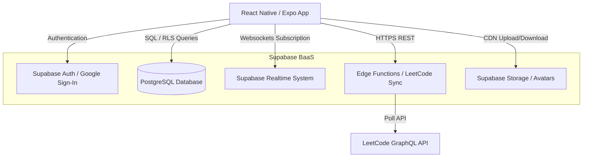
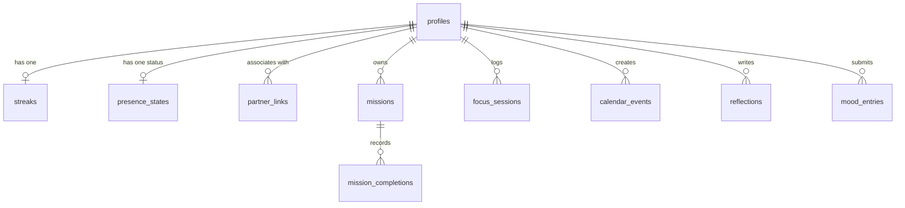
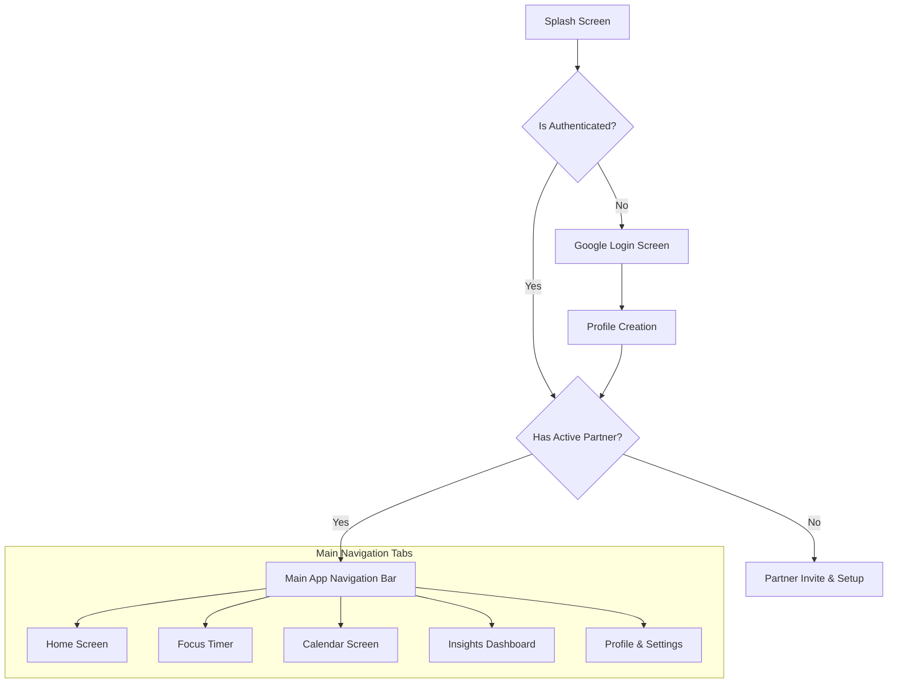
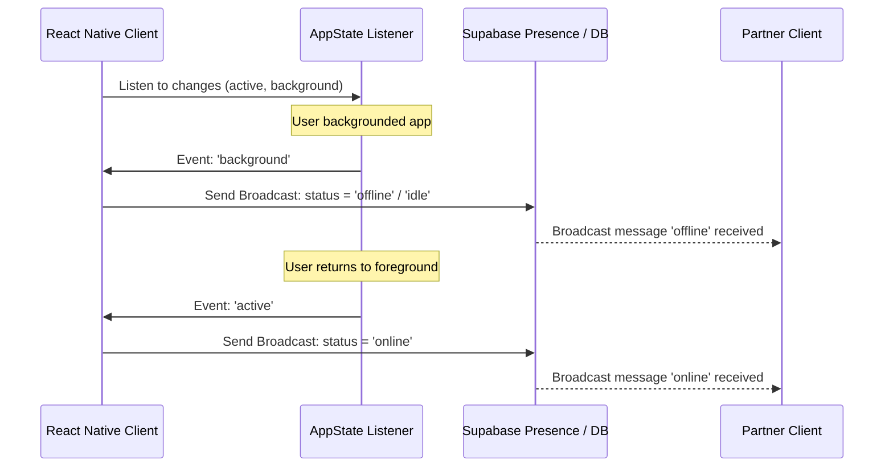

# TECHNICAL_DESIGN.md

# Bloom --- Technical Design Specification

Version: 1.0

---

## 1. System Architecture

Bloom is a client-server application built with a mobile-first philosophy, utilizing React Native (Expo) on the frontend and Supabase (PostgreSQL + Realtime + Edge Functions) on the backend.



### 1.1 Frontend Architecture

The mobile app uses a **Feature-Based Modular Architecture** combined with React Hooks for state management:

- **Components**: Pure presentational MD3 components.
- **Hooks**: Domain-specific logic (e.g., `useFocusTimer`, `usePresence`, `useMissions`).
- **Services**: Client modules interacting with external APIs (Supabase client, LeetCode client).
- **Contexts**: Global app states (e.g., `AuthContext`, `ThemeContext`, `PartnerContext`).

### 1.2 Backend Architecture (Supabase)

- **Database**: PostgreSQL with Row Level Security (RLS) rules verifying that users can only read/write their own data and their connected partner's data.
- **Realtime**: WebSocket channels tracking partner presence, focus timer status, and daily mission completions.
- **Edge Functions**: Serverless TypeScript functions executing heavy/cron tasks (e.g., LeetCode daily sync, weekly report compilation).

---

## 2. Database Design & Schema

### 2.1 Database Schema (DDL)

```sql
-- Enable UUID extension
create extension if not exists "uuid-ossp";

-- 1. PROFILES
create table public.profiles (
    id uuid references auth.users on delete cascade primary key,
    updated_at timestamp with time zone default timezone('utc'::text, now()) not null,
    display_name text,
    avatar_url text,
    leetcode_username text,
    timezone text default 'UTC' not null,
    freeze_tokens integer default 3 not null,
    theme_slug text default 'bloom' not null
);

-- 2. PARTNER LINKS (Strictly 1-to-1 relationships)
create table public.partner_links (
    id uuid default uuid_generate_v4() primary key,
    user_one_id uuid references public.profiles(id) on delete cascade not null,
    user_two_id uuid references public.profiles(id) on delete cascade not null,
    status text check (status in ('pending', 'active')) not null,
    created_at timestamp with time zone default timezone('utc'::text, now()) not null,
    constraint unique_partner_pair unique (user_one_id, user_two_id),
    constraint no_self_link check (user_one_id <> user_two_id)
);

-- 3. MISSIONS
create table public.missions (
    id uuid default uuid_generate_v4() primary key,
    user_id uuid references public.profiles(id) on delete cascade not null,
    name text not null,
    category text not null,
    goal_value integer not null,
    unit text not null, -- 'boolean', 'count', 'minutes', etc.
    verification_type text check (verification_type in ('manual', 'timer', 'leetcode')) not null,
    repeat_schedule text default 'daily' not null, -- 'daily', 'weekly', 'custom'
    color_hex text not null,
    is_archived boolean default false not null,
    created_at timestamp with time zone default timezone('utc'::text, now()) not null
);

-- 4. MISSION COMPLETIONS
create table public.mission_completions (
    id uuid default uuid_generate_v4() primary key,
    mission_id uuid references public.missions(id) on delete cascade not null,
    completed_date date not null,
    current_value integer not null,
    is_completed boolean default false not null,
    verified_at timestamp with time zone,
    updated_at timestamp with time zone default timezone('utc'::text, now()) not null,
    constraint unique_mission_day unique (mission_id, completed_date)
);

-- 5. FOCUS SESSIONS
create table public.focus_sessions (
    id uuid default uuid_generate_v4() primary key,
    user_id uuid references public.profiles(id) on delete cascade not null,
    start_time timestamp with time zone not null,
    end_time timestamp with time zone,
    duration_seconds integer default 0 not null,
    category text,
    is_completed boolean default false not null
);

-- 6. PRESENCE STATE (Ephemeral & tracked via Realtime / DB fallback)
create table public.presence_states (
    user_id uuid references public.profiles(id) on delete cascade primary key,
    status text check (status in ('offline', 'online', 'studying', 'break', 'busy', 'sleeping')) not null,
    last_active timestamp with time zone default timezone('utc'::text, now()) not null
);

-- 7. CALENDAR EVENTS
create table public.calendar_events (
    id uuid default uuid_generate_v4() primary key,
    created_by uuid references public.profiles(id) on delete cascade not null,
    title text not null,
    description text,
    event_date date not null,
    event_type text check (event_type in ('personal', 'partner', 'shared', 'deadline')) not null,
    repeat_type text check (repeat_type in ('none', 'daily', 'weekly', 'monthly')) default 'none' not null,
    created_at timestamp with time zone default timezone('utc'::text, now()) not null
);

-- 8. REFLECTIONS
create table public.reflections (
    id uuid default uuid_generate_v4() primary key,
    user_id uuid references public.profiles(id) on delete cascade not null,
    reflection_date date not null,
    thought_of_day text,
    wins text,
    challenges text,
    created_at timestamp with time zone default timezone('utc'::text, now()) not null,
    constraint unique_reflection_day unique (user_id, reflection_date)
);

-- 9. MOOD ENTRIES
create table public.mood_entries (
    id uuid default uuid_generate_v4() primary key,
    user_id uuid references public.profiles(id) on delete cascade not null,
    entry_date date not null,
    mood_score integer check (mood_score between 1 and 5) not null,
    distraction_tags text[], -- Array of strings (e.g. ['social_media', 'overslept'])
    custom_notes text,
    created_at timestamp with time zone default timezone('utc'::text, now()) not null,
    constraint unique_mood_day unique (user_id, entry_date)
);

-- 10. STREAKS
create table public.streaks (
    user_id uuid references public.profiles(id) on delete cascade primary key,
    current_streak integer default 0 not null,
    longest_streak integer default 0 not null,
    last_completion_date date,
    updated_at timestamp with time zone default timezone('utc'::text, now()) not null
);
```

### 2.2 Entity Relationship Diagram (ERD)



### 2.3 Indexes & Performance Optimization

To guarantee swift execution sub-2 seconds:

- **Missions queries**: `create index idx_missions_user_id on public.missions(user_id) where is_archived = false;`
- **Mission completions by date**: `create index idx_mission_completions_date on public.mission_completions(completed_date, mission_id);`
- **Focus sessions history**: `create index idx_focus_sessions_user_time on public.focus_sessions(user_id, start_time desc);`
- **Partner checks**: `create index idx_partner_links_lookup on public.partner_links(user_one_id, user_two_id);`

### 2.4 Row Level Security (RLS) Policy Example

Every table restricts access to the user and their validated partner:

```sql
-- Helper function to fetch partner ID
create or replace function public.get_partner_id(user_uuid uuid)
returns uuid as $$
  select case 
    when user_one_id = user_uuid then user_two_id
    else user_one_id
  end
  from public.partner_links
  where (user_one_id = user_uuid or user_two_id = user_uuid) and status = 'active'
  limit 1;
$$ language sql security definer;

-- Enable RLS on Missions
alter table public.missions enable row level security;

-- Policy: Select missions (own + partner)
create policy "Users can view own and partner missions" on public.missions
    for select using (
        auth.uid() = user_id or 
        user_id = public.get_partner_id(auth.uid())
    );

-- Policy: Write missions (own only)
create policy "Users can modify own missions" on public.missions
    for all using (auth.uid() = user_id);
```

---

## 3. Screen Navigation Flows & UI States

The navigation layout uses **React Navigation v6** (`@react-navigation/native` & `@react-navigation/bottom-tabs`).



### 3.1 Standard UI State Patterns

Every feature follows standardized MD3 layout responses:

1. **Loading State**:
   - Use `ActivityIndicator` (MD3 Circular Progress indicator).
   - Skeletal components (`react-native-masked-view` + Shimmer) for cards to match component outlines.
2. **Error Flow**:
   - Display full-screen error component with a supportive illustration.
   - Provide clear, friendly error explanations and a "Retry" button.
3. **Empty State**:
   - Clear graphical representations with supportive prompts and secondary actions.
   - Example: On Focus screen, if no history: "Time to start! Begin your first deep work session." with a green filled button.

---

## 4. Detailed Feature Implementations

### 4.1 Presence & AppState (Realtime Sync)

The presence system uses Supabase Realtime Channels to broadcast updates.



- **Inactive/Background States**: Triggered immediately upon state changes. If user is in Focus Mode, transitions status to "offline" and pauses the local timer.

### 4.2 Focus Timer (Foreground Lock)

To enforce genuine focus, the timer runs local state and hooks directly into the React Native `AppState` API.

- **Execution Logic**:
  1. User starts timer -> app updates `presence_states` to `studying`.
  2. `AppState` changes to `background` -> app stores timestamp, pauses local counter, updates server state to `idle`.
  3. On return to `foreground` -> MD3 Modal appears: "You were away. Resume your session?"
  4. If confirmed, recalculates duration elapsed while active, then resumes counting.
  5. Once complete, writes a new record directly to `focus_sessions` and triggers success celebration (using `canvas-confetti` or native RN Lottie animation).

### 4.3 LeetCode Auto-Verification Sync

A nightly cron-like routine triggers an Edge Function to sync LeetCode statistics.

- **Verification Flow**:
  1. User adds LeetCode Username in Profile.
  2. Edge Function triggers daily at midnight (user's local timezone).
  3. Fetches profile statistics from LeetCode API (GraphQL query: `matchedUser(username: $username) { submitStats { acSubmissionNum { difficulty count } } }`).
  4. Compiles count of total solved problems for the current day.
  5. Compares to previous day's baseline to find today's incremental solved count.
  6. If incremental solved >= Mission target, updates `mission_completions` -> `is_completed = true` and `verified_at = now()`.

### 4.4 Streaks & The Daily Freeze System

Streaks are evaluated daily per user relative to the midnight rollover of their configured timezone:

- **Streak Evaluation Logic**:
  1. At rollover, check `mission_completions` for the previous day.
  2. If all active missions are completed -> increment `current_streak`.
  3. If any active mission is incomplete -> check if `freeze_tokens > 0`.
     - If yes: Deduct 1 `freeze_token` from `profiles`, preserve `current_streak`, insert dummy entry in database logging the freeze usage.
     - If no: Reset `current_streak` to `0`.
  4. Notify user of status: "Streak protected via Freeze!" or "Streak reset. Let's start fresh today!"

---

## 5. Security & Push Notifications

### 5.1 Row Level Security (RLS)

The database leverages postgres row-level security. We ensure queries check ownership `auth.uid() = user_id` or query the partner lookup `user_id = public.get_partner_id(auth.uid())`. This blocks all cross-tenant access.

### 5.2 Push Notification Rules

Notifications are processed via **Expo Push Notifications**:

- Push tokens are uploaded on log in to a `push_tokens` database table.
- Database triggers track changes in `presence_states` and `focus_sessions`.
- When `focus_sessions` completes, a trigger fires an Edge Function to send a push payload to the partner's token.
- Notification payloads contain supportive, positive phrasing: "Your partner just completed 60 minutes of Focus Mode! Send them some encouragement."

---

## 6. Verification & Staging Strategy

### 6.1 Automated Tests

- **Unit testing**: Jest for hooks (`useFocusTimer`, `usePresence`) and business validation algorithms (streak counters, freeze calculations).
- **Integration testing**: Supabase CLI local database testing for testing RLS policies and DB trigger scripts.

### 6.2 Manual Staging Verification

- **Simulators**: Run two concurrent simulator instances (Android Emulator and iOS Simulator) to test realtime presence indicators, bottom sheet interactions, and socket broadcast events.
- **Device tests**: USB-connected Android phone testing to trace device behavior, foreground/background AppState events, and system notifications.
