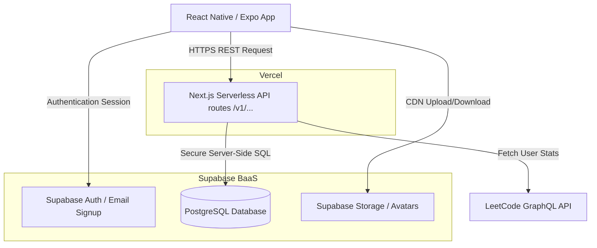
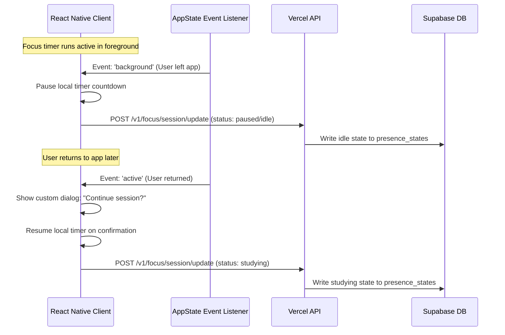

# TECHNICAL_DESIGN.md

# Bloom — Technical Design Specification

**Version**: 2.0 (Updated Stack)
**Scope**: Client-Server Architecture via Vercel Next.js API & Supabase

---

## 1. System Architecture

Bloom uses a decoupled middle-tier architecture. The React Native mobile client never queries the database directly; instead, it communicates via standard HTTP REST endpoints with a Next.js serverless API hosted on Vercel. Vercel acts as the secure intermediary that interacts with the Supabase database.



### 1.1 Frontend Architecture

* **Framework**: React Native + Expo (TypeScript).
* **Styling**: TailwindCSS (NativeWind).
* **State Management**: React Context API (e.g. `AuthContext`, `FocusContext`, `MissionsContext`) providing modular, lightweight state containers.
* **UI Controls**: Fully custom premium components (curves, custom sliders, custom checklist views, pulsing animations). **No React Native Paper / Material UI component libraries**.

### 1.2 Backend Architecture (Vercel + Supabase)

* **API Layer (Vercel)**: Next.js API routes (e.g. `bloom-api.vercel.app/v1/...`) handle authentication routing, business logic, LeetCode data resolution, and database transactions.
* **Database (Supabase)**: PostgreSQL database storing user records, missions, focus history, calendar events, reflections, and mood telemetry.
* **Realtime Sync**: Light presence states and partner notes are stored in dedicated database tables. The mobile app fetches updates using lightweight REST polling/state calls (avoiding high-maintenance WebSocket servers).

---

## 2. Database Design & Schema

### 2.1 Database Schema (DDL)

```sql
-- Enable UUID extension
create extension if not exists "uuid-ossp";

-- 1. PROFILES
create table public.profiles (
    id uuid references auth.users on delete cascade primary key,
    updated_at timestamp with time zone default timezone('utc'::text, now()) not null,
    display_name text,
    avatar_url text,
    leetcode_username text,
    timezone text default 'UTC' not null,
    freeze_tokens integer default 3 not null,
    theme_slug text default 'bloom' not null
);

-- 2. PARTNER LINKS (Strictly 1-to-1 relationships)
create table public.partner_links (
    id uuid default uuid_generate_v4() primary key,
    user_one_id uuid references public.profiles(id) on delete cascade not null,
    user_two_id uuid references public.profiles(id) on delete cascade not null,
    status text check (status in ('pending', 'active')) not null,
    created_at timestamp with time zone default timezone('utc'::text, now()) not null,
    constraint unique_partner_pair unique (user_one_id, user_two_id),
    constraint no_self_link check (user_one_id <> user_two_id)
);

-- 3. MISSIONS (Habits)
create table public.missions (
    id uuid default uuid_generate_v4() primary key,
    user_id uuid references public.profiles(id) on delete cascade not null,
    name text not null,
    category text not null,
    goal_value integer not null,
    unit text not null, -- 'boolean', 'count', 'minutes'
    verification_type text check (verification_type in ('manual', 'timer', 'leetcode')) not null,
    repeat_schedule text default 'daily' not null,
    color_hex text not null,
    is_archived boolean default false not null,
    created_at timestamp with time zone default timezone('utc'::text, now()) not null
);

-- 4. MISSION COMPLETIONS
create table public.mission_completions (
    id uuid default uuid_generate_v4() primary key,
    mission_id uuid references public.missions(id) on delete cascade not null,
    completed_date date not null,
    current_value integer not null,
    is_completed boolean default false not null,
    verified_at timestamp with time zone,
    updated_at timestamp with time zone default timezone('utc'::text, now()) not null,
    constraint unique_mission_day unique (mission_id, completed_date)
);

-- 5. FOCUS SESSIONS
create table public.focus_sessions (
    id uuid default uuid_generate_v4() primary key,
    user_id uuid references public.profiles(id) on delete cascade not null,
    start_time timestamp with time zone not null,
    end_time timestamp with time zone,
    duration_seconds integer default 0 not null,
    category text not null,
    notes text,
    mood_rating integer check (mood_rating between 1 and 5),
    distractions text,
    is_completed boolean default false not null
);

-- 6. PRESENCE STATE (Polled / updated REST states)
create table public.presence_states (
    user_id uuid references public.profiles(id) on delete cascade primary key,
    status text check (status in ('offline', 'online', 'studying', 'break', 'busy', 'sleeping')) not null,
    last_active timestamp with time zone default timezone('utc'::text, now()) not null
);

-- 7. CALENDAR EVENTS
create table public.calendar_events (
    id uuid default uuid_generate_v4() primary key,
    created_by uuid references public.profiles(id) on delete cascade not null,
    title text not null,
    description text,
    event_date date not null,
    event_type text check (event_type in ('personal', 'partner', 'shared', 'deadline')) not null,
    repeat_type text check (repeat_type in ('none', 'daily', 'weekly', 'monthly')) default 'none' not null,
    created_at timestamp with time zone default timezone('utc'::text, now()) not null
);

-- 8. REFLECTIONS (Thoughts of the Day)
create table public.reflections (
    id uuid default uuid_generate_v4() primary key,
    user_id uuid references public.profiles(id) not null,
    reflection_date date not null,
    content text not null,
    created_at timestamp with time zone default timezone('utc'::text, now()) not null,
    constraint unique_reflection_day unique (user_id, reflection_date)
);

-- 9. MOOD ENTRIES
create table public.mood_entries (
    id uuid default uuid_generate_v4() primary key,
    user_id uuid references public.profiles(id) on delete cascade not null,
    entry_date date not null,
    mood_score integer check (mood_score between 1 and 5) not null,
    distractions text[], -- Array of logged distractions
    created_at timestamp with time zone default timezone('utc'::text, now()) not null,
    constraint unique_mood_day unique (user_id, entry_date)
);

-- 10. STREAKS
create table public.streaks (
    user_id uuid references public.profiles(id) on delete cascade primary key,
    current_streak integer default 0 not null,
    longest_streak integer default 0 not null,
    last_completion_date date,
    updated_at timestamp with time zone default timezone('utc'::text, now()) not null
);
```

---

## 3. API Endpoints Specification

Vercel hosts the Next.js API server, accepting JSON payloads and verifying Supabase auth tokens in headers.

### 3.1 Authentication & Profile

* `POST /v1/auth/signup`: Creates auth login credentials in Supabase.
* `POST /v1/auth/login`: Signs into Supabase using email/password.
* `GET /v1/profile`: Returns the profile information for the authenticated user (themes, freeze tokens, custom settings).
* `PUT /v1/profile`: Updates current user profile configurations (display name, avatar URL, LeetCode username).

### 3.2 Partner Linking

* `POST /v1/partner/invite`: Generates a unique 6-character connect code linked to the user's account.
* `POST /v1/partner/connect`: Submits a partner code to link two user profiles as active partners in `partner_links`.
* `POST /v1/partner/disconnect`: Dissolves an active link between partners.
* `GET /v1/partner/status`: Returns current focus status, progress percentage, active streak, and latest reflection preview of the connected partner.

### 3.3 Daily Missions & Habits

* `GET /v1/missions`: Retrieves the current user's active custom habits, daily completions, and partner statistics.
* `POST /v1/missions`: Creates a new mission entry (unit values, categories, color hashes).
* `PUT /v1/missions/:id`: Updates parameters of a mission or flags it as archived.
* `POST /v1/missions/:id/toggle`: Toggles completion of a mission for a specific date. Increments completions and validates streak conditions.
* `POST /v1/missions/leetcode/verify`: Triggers a server-side GraphQL request to LeetCode API to fetch today's solved problems, auto-completing DSA missions on success.

### 3.4 Focus Sessions (Pomodoro)

* `POST /v1/focus/session/start`: Registers that the user has started a focus session (sets status in `presence_states` to `studying`).
* `POST /v1/focus/session/update`: Periodically called during focus to verify foreground active state. Pauses/flags automatically if absent.
* `POST /v1/focus/session/complete`: Logs focus statistics to `focus_sessions` (duration, distractions, mood rating, written review comments).
* `GET /v1/focus/history`: Returns focus sessions logs, averages, daily stats, and weekly bar graph matrices.

### 3.5 Calendar

* `GET /v1/calendar`: Returns color-coded events and tasks for the specified month.
* `POST /v1/calendar/event`: Schedules a new calendar entry (type, title, description, color code, deadline date).
* `DELETE /v1/calendar/event/:id`: Removes a scheduled task or event.

### 3.6 Reflections (Journal)

* `GET /v1/reflections`: Fetches historical list of logged notes/daily thoughts.
* `POST /v1/reflections`: Saves a daily reflection note entry.

### 3.7 Mood, Telemetry & Streaks

* `POST /v1/mood/checkin`: Logs the daily check-in scale values.
* `POST /v1/mood/distractions`: Submits distraction logs (*"What distracted you?"*).
* `POST /v1/streak/freeze`: Spends a freeze token to protect the streak when a day is missed.
* `GET /v1/themes/unlocked`: Evaluates milestone metrics and returns list of unlocked dashboard stylesheet themes.

---

## 4. Focus Timer Background Pause

To prevent "fake" focus tracking, the app utilizes the React Native **AppState API** to track when the application enters the background.



---

## 5. Verification & Testing

* **API Endpoints Testing**: Vercel API endpoints are validated using Jest integration tests mocking database responses, and Postman workspaces.
* **RLS Policies**: Tested via Supabase local CLI database tests to verify users can never fetch or manipulate another user's records unless linked as active partners.
* **Background/Foreground Events**: Verified on Android/iOS simulators and USB-connected developer builds to trace AppState handler execution.
